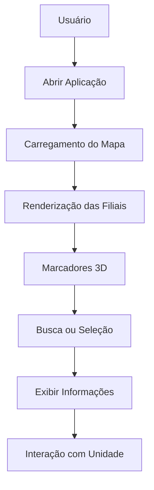

# 🗺️ BarberMap 3D

<div align="center">


Sistema de geolocalização e descoberta de barbearias utilizando mapa interativo 3D, busca inteligente e visualização moderna de unidades.

</div>

---

# 📖 Sobre o Projeto

O **BarberMap 3D** é uma aplicação web desenvolvida para facilitar a localização e visualização de unidades de barbearias em um mapa interativo.

O sistema combina recursos de geolocalização, experiência visual moderna e renderização 3D para proporcionar uma navegação intuitiva e diferenciada.

---

# ✨ Funcionalidades

### 🗺️ Mapa Interativo

- Visualização em mapa 3D
- Navegação fluida
- Zoom dinâmico
- Rotação e inclinação do mapa
- Controles integrados de navegação

### 💈 Marcadores Personalizados

- Marcadores premium animados
- Exibição de logotipo da unidade
- Destaque visual para unidade selecionada
- Efeito de glow e pulse

### 🔍 Busca Inteligente

- Busca por unidade
- Busca por bairro
- Busca por região

### 🏪 Gestão de Filiais

- Nome da unidade
- Distância estimada
- Status de ocupação
- Avaliações
- Tags personalizadas

### 📊 Informações em Tempo Real

- Ocupação da unidade
- Avaliação média
- Indicadores visuais
- Destaques para unidades premium

---

# 🛠️ Stack Tecnológica

## Front-End

<p align="left">

</p>

## Mapas e Geolocalização

- MapLibre GL
- OpenStreetMap
- OpenFreeMap

## Renderização 3D

<p align="left">

</p>

### Bibliotecas Utilizadas

- @react-three/fiber
- @react-three/drei
- Framer Motion
- Floating UI
- Lucide React

---

# 🏗️ Arquitetura

```text
map3d-test/

├── app/
│   ├── page.tsx
│   ├── layout.tsx
│   ├── globals.css
│   └── data/
│
├── components/
│   ├── Map3D.tsx
│   ├── Marker3D.tsx
│   ├── Sidebar.tsx
│   │
│   ├── booking/
│   ├── map/
│   ├── sidebar/
│   ├── three/
│   └── ui/
│
├── public/
│
├── next.config.ts
├── package.json
└── README.md
```

---

# 🔄 Fluxo da Aplicação



---

# 💈 Estrutura das Barbearias

Cada unidade possui:

```typescript
{
  id: string;
  nome: string;
  logoUrl: string;
  distancia: string;
  statusOcupacao: string;
  porcentagemOcupacao: number;
  avaliacao: number;
  coordenadas: [longitude, latitude];
  tags: string[];
}
```

---

# 📍 Dados Exibidos

### Unidade

- Nome
- Logo
- Distância

### Operação

- Status de ocupação
- Percentual de lotação

### Avaliação

- Atendimento
- Ambiente
- Higiene
- Nota geral

---

# 🚀 Instalação

## Clonar Repositório

```bash
git clone <repositorio>
```

## Instalar Dependências

```bash
npm install
```

ou

```bash
npm install --legacy-peer-deps
```

---

## Executar Ambiente Local

```bash
npm run dev
```

Acesse:

```text
http://localhost:3000
```

---

# 📦 Build de Produção

```bash
npm run build
```

```bash
npm start
```

---

# 🎯 Objetivos do Projeto

- Melhorar a experiência de localização de unidades
- Oferecer navegação visual moderna
- Explorar mapas 3D em aplicações web
- Integrar recursos de geolocalização
- Criar uma interface premium para clientes

---

# 🚧 Roadmap

## Interface

- [ ] Modo escuro
- [ ] Responsividade mobile avançada
- [ ] Sidebar dinâmica

## Mapa

- [ ] Rotas até a unidade
- [ ] Geolocalização do usuário
- [ ] Clustering de marcadores
- [ ] Heatmap de ocupação

## Integrações

- [ ] API de barbearias
- [ ] Banco de dados
- [ ] Atualização em tempo real
- [ ] Sistema de agendamentos

## 3D

- [ ] Modelos 3D das unidades
- [ ] Efeitos avançados de iluminação
- [ ] Animações contextuais

---

# 👨‍💻 Autor

**Felype Souza**
🔗 GitHub: https://github.com/FeeSz
---

# 👨‍💻 Colaborador

**Kaio Contrim**
🔗 https://github.com/kaiocotrim


---

# 📄 Licença

Este projeto está licenciado sob a Licença MIT.
